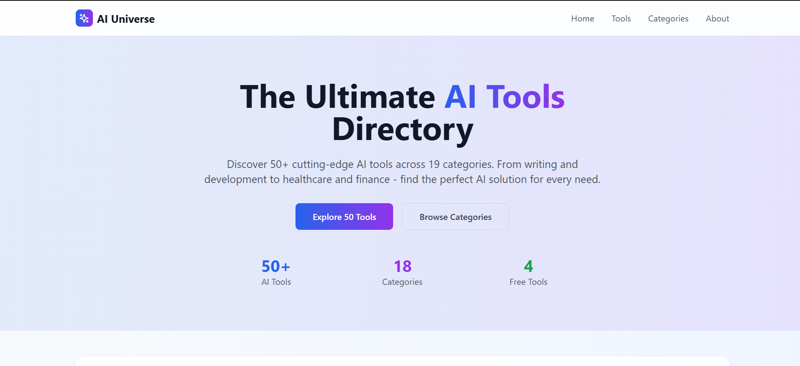
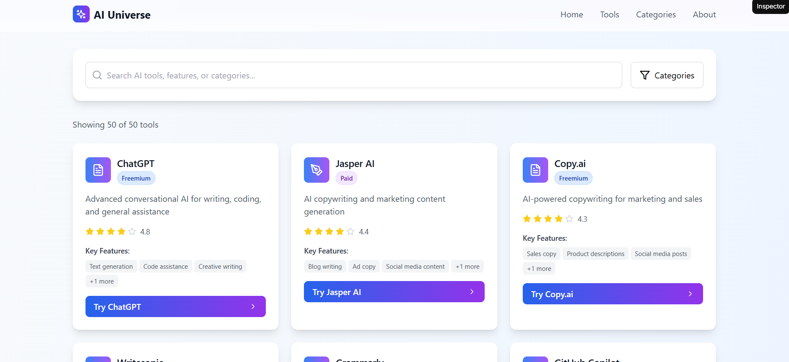

# 🔧 Toolvy – AI Tool Directory

Discover, explore, and access the best AI tools in one place.  
**Toolvy** is a sleek and responsive AI tool directory built with **React**, **TypeScript**, **Vite**, and **Tailwind CSS**.

🔗 [Live Site](https://toolvy.vercel.app)

---

## ✨ Features

- 🧠 Curated list of powerful AI tools  
- 🔍 Real-time search and filter  
- ⚡ Blazing-fast performance with Vite  
- 📱 Fully responsive design  
- 🎨 Clean and modern UI with Tailwind CSS  

---

## 🛠️ Tech Stack

- **Frontend:** React + TypeScript  
- **Styling:** Tailwind CSS  
- **Build Tool:** Vite  
- **Deployment:** Vercel  

---

## 🚀 Getting Started

**Clone the repository:**  
`git clone https://github.com/Keshav-Kathuria/Toolvy.git && cd Toolvy`

**Install dependencies:**  
`npm install`

**Run the development server:**  
`npm run dev`

**Build for production:**  
`npm run build`

---

## 📷 Screenshots

### Homepage  

### Tool Cards  

---

## 🧑‍💻 Contributing

Pull requests are welcome!  
For major changes, please open an issue first to discuss what you’d like to change.

---

## 📬 Connect

Made by **Keshav Kathuria**  
If you find this project helpful, consider giving it a ⭐ on [GitHub](https://github.com/Keshav-Kathuria/Toolvy)!
